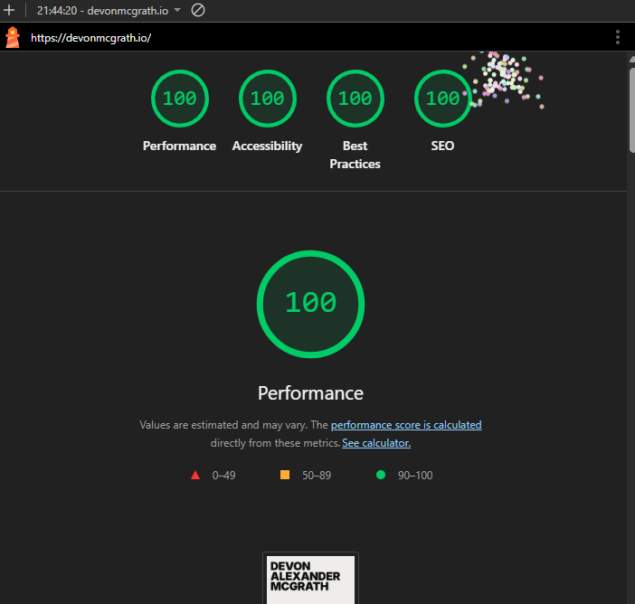

# devonmcgrath.io — Portfolio

This is the source code for my personal portfolio website.
[View it here](https://devonmcgrath.io/) or at the [fallback URL](https://devonsportfolio.netlify.app/)

Built to showcase my projects, experience, and technical work as a frontend developer.

## Tech Stack

- **Next.js** (App Router)
- **TypeScript**
- **Tailwind CSS**
- **Deployed on Netlify**
- **Prettier / ESLint** for formatting and linting

## Features

- Responsive layout built mobile-first
- Accessible, performant UI
- Custom typography via `next/font`
- Clean compartmentalised components (Header / Main / Footer)
- Optimised for long-lived maintainability and iteration

## Performance & Accessibility

The site is built with attention to both runtime performance and inclusive, accessible delivery. Below are the latest Lighthouse scores from the production build:



Key considerations:

- Deferring or gating third-party scripts (ads, analytics) to preserve LCP/FID
- Using semantic HTML and ARIA only where needed (no “div soup”)
- Preserving keyboard navigation and focus states across interactive elements
- Ensuring sufficient contrast ratios and robust dark/light color choices

## Development

```bash
pnpm install
pnpm run dev
```
